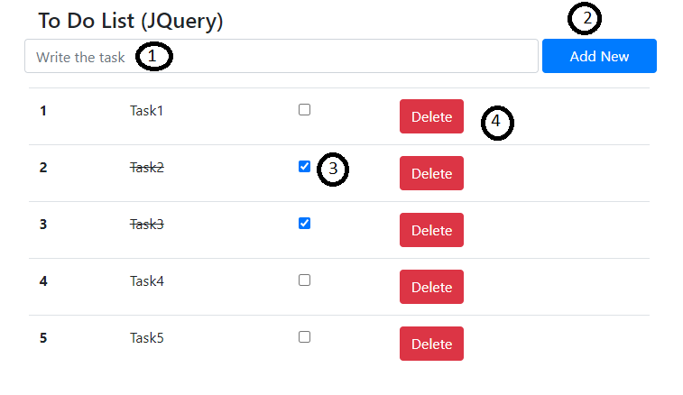

# JQuery To-Do-List



## Demo Link
```
https://khinezinthaw7.github.io/jquery-to-do/index.html
```

- [JQuery To-Do-List](#jquery-to-do-list)
  - [Demo Link](#demo-link)
  - [Text Input Field](#text-input-field)
  - [Add New Button](#add-new-button)
  - [Done Checkbox](#done-checkbox)
  - [Delete Button](#delete-button)

## Text Input Field

This is the text field to fill your task.

## Add New Button

The button is to add new task and store to localstorage.

## Done Checkbox

The task is done when click the checkbox.

## Delete Button

This button is to delete the task.
